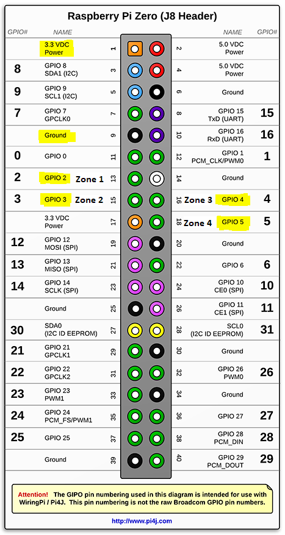
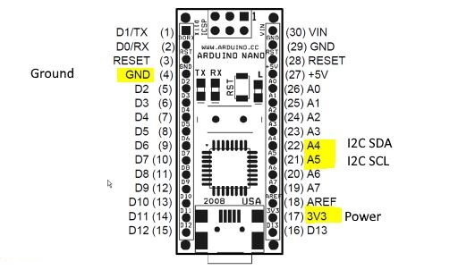

Box O' Dooooom
==============

Electronics are in two parts. A Raspberry Pi Zero with a Java controlling program which picks up data from 
PIR (Passive Infra Red) detectors.
The detectors are split into 4 zones, each zone when activated will control a set of 4 servos via a set of messages.

The Ardunio program controls code for processing messages coming from an external source (Pi or otherwise) 
and transmits the resulting command to control servos via a PWM controller (PCA9685 chip).

Communications between the Zero and the Nano are via a serial interface setup by the two devices automatically 
when connected by a USB cable. Power is supplied to drive the Nano via the USB cable at 5v.

I am using a Ardunio Nano as I could not get the equivalent servo control code for Rasp Pi to work properly.

Messages coming into the Nano are in the form of a string `"{<command> <servo> <speed>}"` where command is a three letter code, servo is a
number between 0 and 15 (depending on chained PCA9685 boards) and the speed is a value between 0 and 10. The speed introduces
a delay beween steps in the servo turn of up to 100 milliseconds. So zero is fastest and 10 is slowest.

Commands implemented:
- SWP - Sweeps the servo from the 0 angle to the 160 degree angle, wait a half second and sweep back again to 0 angle.
- OPN - Sweeps the servo from the 0 angle to the 160 degree angle.
- CLS - Sweeps the servo from the 160 angle to the 0 degree angle, servo should already have been opened.

The PCA9685 board use I2C to communicate, 2 pins are required to
interface. For Arduino Nanos, thats SCL -> Analog 5, SDA -> Analog 4
Power should be 3.3 volts for the control chip. V+ supplies the servos
and should not be supplied from the Nano. This is because Servos can put
a lot of noise on the bus and can scramble signals from the nano.

Power is supplied to the PWC board and the servos externally via a 10A 5v adapter with a normal 3.2 mm barrel connector. 

To rebuild software 
-------------------

Uses Maven to define dependencies and build process for the Java project

For Ardunio:

Dependancies
------------

Java 1.8.0

pi4j GPIO library, version 1.2-SNAPSHOT

log4j logging libary, version 2/7 (requires core and api components) 

To Build final
--------------

`mvn clean package`

To run
------

Connections
-----------

Raspberry Pi Zero pinouts used: 

Ardunio Nano pinouts used: 

Notes
-----

- Log file `output.log` will be created in same folder as jar file. 

